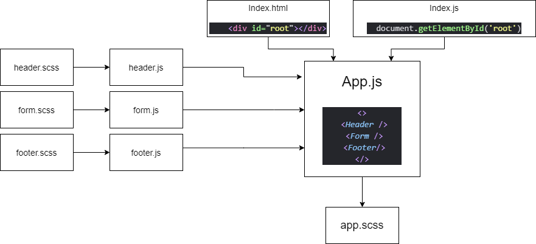

# LAB: Class 26 - Component Based UI

+ RESTy Phase 1: Begin work on the RESTy API testing application

## Author: Stacy Burris

### Links

+ [Pull request](https://github.com/stacyburris/resty/pull/1)
+ [Resty Repo](https://github.com/stacyburris/resty)

### Setup

+ Created repo
+ Navigate to where you want to put it
+ npx create-react-app `<`repo name>`
+ Deleted unnecessary files

### Running the app

+ Terminal:
  + npm start or nodemon
    + `http://localhost:3000/`
    + Enter any url
    + Click Go!
    + Click route

### UML

